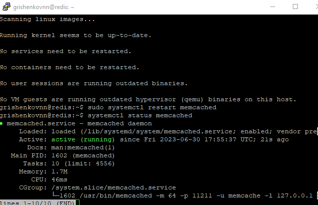
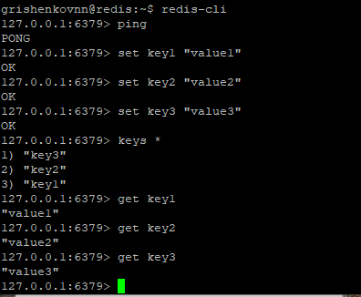

# Домашнее задание к занятию «Кеширование Redis/memcached»

### Инструкция по выполнению домашнего задания

1. Сделайте fork [репозитория c шаблоном решения](https://github.com/netology-code/sys-pattern-homework) к себе в Github и переименуйте его по названию или номеру занятия, например, https://github.com/имя-вашего-репозитория/gitlab-hw или https://github.com/имя-вашего-репозитория/8-03-hw).
2. Выполните клонирование этого репозитория к себе на ПК с помощью команды `git clone`.
3. Выполните домашнее задание и заполните у себя локально этот файл README.md:
   - впишите вверху название занятия и ваши фамилию и имя;
   - в каждом задании добавьте решение в требуемом виде: текст/код/скриншоты/ссылка;
   - для корректного добавления скриншотов воспользуйтесь инструкцией [«Как вставить скриншот в шаблон с решением»](https://github.com/netology-code/sys-pattern-homework/blob/main/screen-instruction.md);
   - при оформлении используйте возможности языка разметки md. Коротко об этом можно посмотреть в [инструкции по MarkDown](https://github.com/netology-code/sys-pattern-homework/blob/main/md-instruction.md).
4. После завершения работы над домашним заданием сделайте коммит (`git commit -m "comment"`) и отправьте его на Github (`git push origin`).
5. Для проверки домашнего задания преподавателем в личном кабинете прикрепите и отправьте ссылку на решение в виде md-файла в вашем Github.
6. Любые вопросы задавайте в чате учебной группы и/или в разделе «Вопросы по заданию» в личном кабинете.

Желаем успехов в выполнении домашнего задания.

---

### Задание 1. Кеширование 

Приведите примеры проблем, которые может решить кеширование. 

*Приведите ответ в свободной форме.*

### Ответ:

Кеширование — это процесс временного хранения данных в специальном быстром доступном месте, чтобы обеспечить быстрый доступ к этим данным и улучшить общую производительность системы. Вот несколько примеров проблем, которые может решить кеширование:

  1. Увеличение скорости доступа к данным: Когда данные кешируются, они сохраняются в более быстром хранилище, например в оперативной памяти или на быстрых твердотельных накопителях (SSD). Это позволяет значительно сократить время доступа к данным, поскольку нет необходимости загружать их с медленных дисковых накопителей или из удаленных источников.

  2. Снижение нагрузки на серверы: Если данные часто запрашиваются, кеширование позволяет предоставлять эти данные непосредственно из кеша, минуя дорогостоящие операции получения или вычисления. Это снижает нагрузку на серверы и улучшает отзывчивость системы.

  3. Сокращение использования сетевого трафика: Кеширование может снизить объем передаваемых данных по сети. Если данные уже находятся в кеше, их можно получить локально, избегая необходимости загружать их с удаленного сервера. Это особенно полезно в случае медленных или ненадежных сетевых соединений.

  4.  Улучшение масштабируемости: Кеширование может значительно улучшить масштабируемость системы путем снижения нагрузки на базовые ресурсы. Если данные уже есть в кеше, нет необходимости выполнять сложные операции получения или вычисления, что позволяет обрабатывать больше запросов одновременно.

  5. Повышение доступности: Кеширование может повысить доступность данных, особенно в случаях, когда источник данных недоступен или имеет ограниченную пропускную способность. Если данные уже есть в кеше, их можно использовать даже в случае отказа или задержки доступа к основному источнику.

В целом, кеширование является эффективным инструментом для оптимизации производительности и улучшения отзывчивости системы в различных сценариях.

---

### Задание 2. Memcached

Установите и запустите memcached.

*Приведите скриншот systemctl status memcached, где будет видно, что memcached запущен.*

### Ответ:

---

### Задание 3. Удаление по TTL в Memcached

Запишите в memcached несколько ключей с любыми именами и значениями, для которых выставлен TTL 5. 

*Приведите скриншот, на котором видно, что спустя 5 секунд ключи удалились из базы.*

### Ответ:

---

### Задание 4. Запись данных в Redis

Запишите в Redis несколько ключей с любыми именами и значениями. 

*Через redis-cli достаньте все записанные ключи и значения из базы, приведите скриншот этой операции.*

### Ответ:

## Дополнительные задания (со звёздочкой*)
Эти задания дополнительные, то есть не обязательные к выполнению, и никак не повлияют на получение вами зачёта по этому домашнему заданию. Вы можете их выполнить, если хотите глубже разобраться в материале.

### Задание 5*. Работа с числами 

Запишите в Redis ключ key5 со значением типа "int" равным числу 5. Увеличьте его на 5, чтобы в итоге в значении лежало число 10.  

*Приведите скриншот, где будут проделаны все операции и будет видно, что значение key5 стало равно 10.*

### Ответ:

